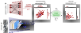
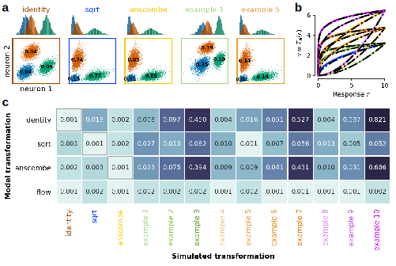
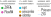
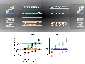
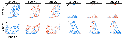
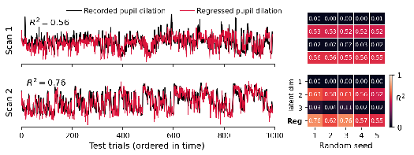

**Models neural activity by combining stimulus information with factor analysis of noise correlation.**
Discovery of latent variables governing noise correlation.

## Problem

Model $p(\br \mid \bx)$ of population activity $\br \in ℝ^n$ to an arbitrary stimulus $\bx$.
Two main sources of variance:

- **Stimulus-driven activity**: $\bf_θ(\bx) = 𝔼[\br \mid \bx]$, responses dependent on an _arbitrary_ stimulus.
  Assumes conditional independence among neurons.
- **Stimulus-conditioned variability**: $\mathrm{Var}[\br \mid \bx]$, responses to repeated presentations of an _identical_ stimulus.
  - Variability to the repeated presentations of identical stimuli, called _noise correlations_.
  - Dependent on stimulus, behavioral task, attention, brain state.
  - Others fit $p(\br\mid\bx)$ separately for each unique stimulus and require repeated presentations of said stimulus.

This paper introduces a model that accounts for both.

## Model

$$
p(\br \mid \bx) = \N( T_φ(\br); \bf_θ(\bx), \mathbf{C} \mathbf{C}^\T + Ψ) ⋅ |\det ∇_\br \, T_φ(r)|
$$

<aside>

More [background](https://lilianweng.github.io/posts/2018-10-13-flow-models/) of flow-based models.

</aside>

- Spiking data is transformed using a trained **normalizing flow** $T_φ(\br)$
  $$
  T_φ(\br) = \mathrm{Affine} ∘ \exp ∘ \mathrm{Affine} ∘ \mathrm{ELU} ∘ \mathrm{Affine} ∘ \mathrm{ELU} ∘ \mathrm{Affine} ∘ \log ∘ \mathrm{Affine}
  $$
  where only the affine transformations are trainable.
  The flow acts on each dimension independently,
  that is $T_φ(\br) = [T_{φ_1}(r_1), \dots, T_{φ_n}(r_n)]^\T$.
  - ZIFFA includes a zero-inflated component to capture zero spikes.
  - Dependency of noise correlation on the stimulus can be indirectly captured during this transformation.

<aside>

For the differences between PCA and factor analysis, see this excellent [answer](https://stats.stackexchange.com/a/288646).
Roughly, FA is PCA with a low-rank probabilistic component.

</aside>

- **Stimulus-conditioned variability:**: The second-order variability is captured using a factor analysis model,
  which is a covariance matrix with rank equal to the number of latent variables $\bz$.
  The self-variance $Ψ_i$ is distinct for each neuron.
- **Stimulus-driven activity**: The means of the Gaussian transformed spikes $\E[\br\mid\bx] = \bf_θ(\bx)$ are modeled based on their previous paper [@lurzGeneralizationDatadriven2020].

### Rationale

Factor analysis assumes Gaussianity whereas
spike rates are strictly positive
and are distributed like a zero-inflated overdispersed Poisson distribution.
Fixed transformations may be too limiting and cannot capture neuron-specific transformations.

### Related Papers

[@keeleyIdentifyingSignal2020]

### Data

6,000 images from ImageNet were shown in each scan.

- 1,000 images consist of 100 unique images each repeated 10 times to allow for an estimate of the neural response variability. We used the repeated images for testing.
- 4,500 training and 500 validation images.

~1,000 neurons from LM and V1 recovered.

## Performance

### Flow Transformation Performance

<aside>

**Normalizing flow fit**.
FlowFA is flexible enough to fit these transformations.

Numbers in the table are KL-divergence.

</aside>

### Comparisons

FA models outperform independent models.
Although **fixed transformations work better for conditional correlation.**

<aside>

**Likelihood of model fit.**
ZIFFA can fit with a higher log-likelihood.

**Conditional correlation**
$\E[r_i \mid \bx, \br_{/i}]$.
FA models fit better than independent models.

</aside>

## Latent variables

The latent variables describe **noise correlations** (neuron-neuron correlations) from FA.
These are inferred without repeats.

Correlations of the extracted latent variables ($k=3$) to various values.
Position does seem to be a significant contributor to intrinsic variability,
in addition to pupil size.

<aside>

Latent variables as a function of **cortex position**.

</aside>

<aside>

Latent variables as a function of **RF position**.

</aside>

<aside>

Latent variables as a function of **pupil dilation**.

</aside>

## References

[^ref]
