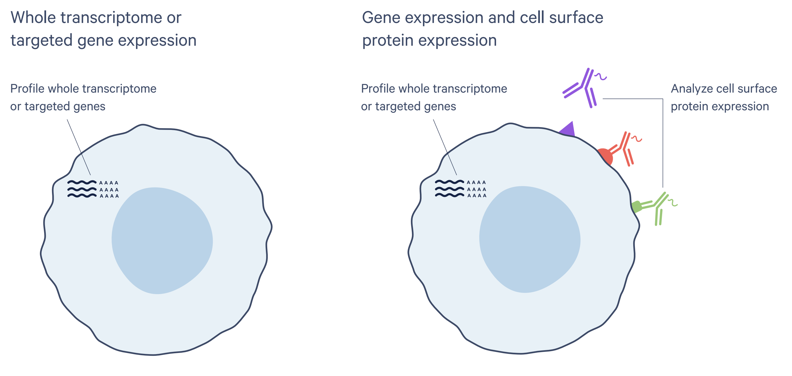
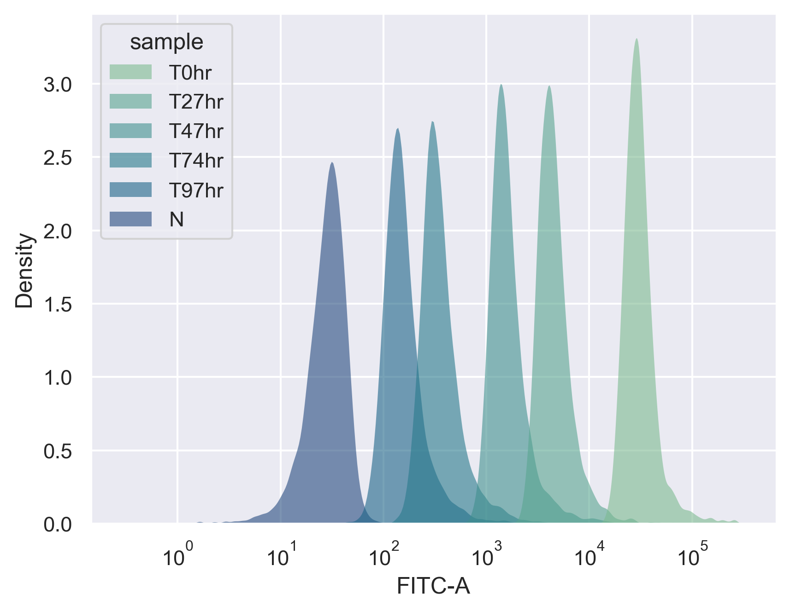
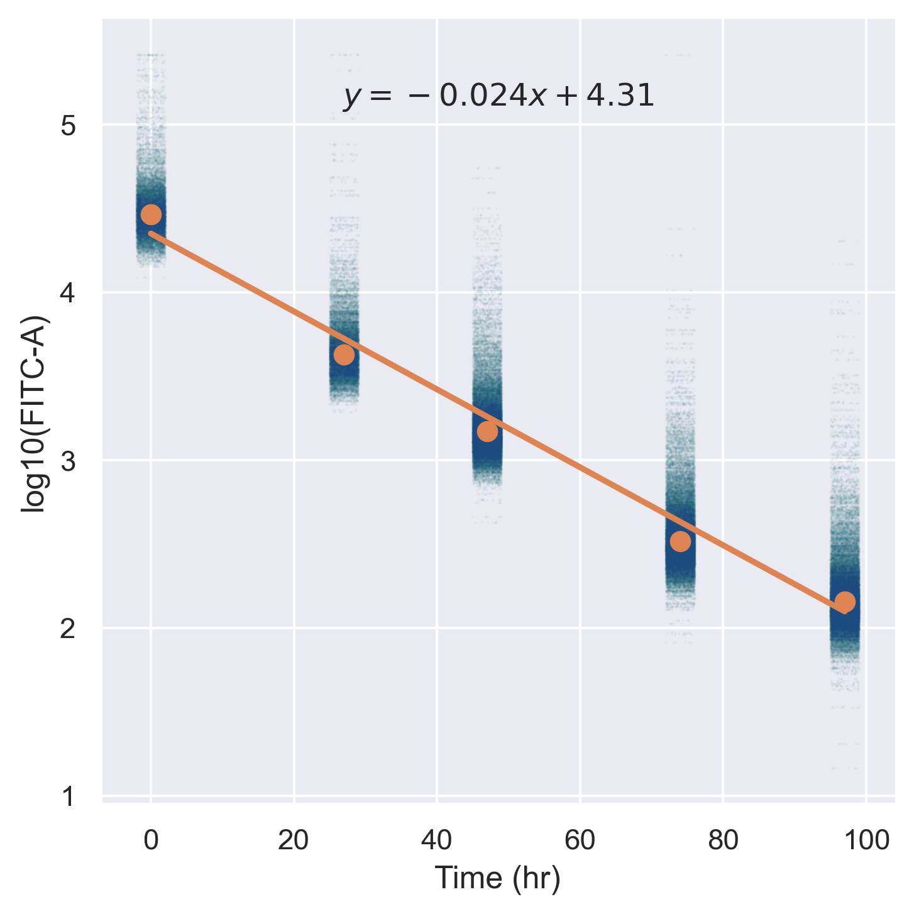
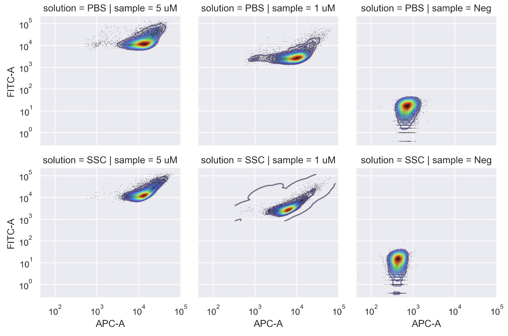
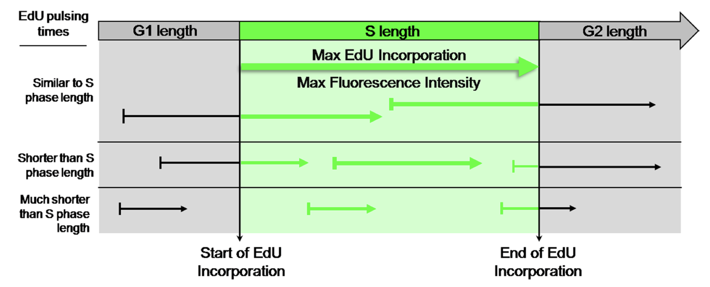

> Get number of divisions + expression data.

## EdU

<aside>

Basically, EdU (left) is a thymine whose methyl group is replaced by an ethynyl (alkyne) group.

</aside>

5-Ethynyl-2′-deoxyuridine (EdU) is a nucleoside analogue of thymine (T).
This change opens us to the world of bioorthogonal labeling as an alkyne is virtually absent in biological systems.
In the presence of copper, an alkyne can react with an azide group to form a ring, "clicking" two molecules together.
This is called Copper-Catalyzed Azide-Alkyne Cycloaddition (CuAAC).
Typically, cells that are labelled with EdU are visualized with an azide fluorophore.
However, this tracing information cannot be retrieved in a single-cell sequencing system.
Therefore, we propose labeling EdU with an azide-tagged barcoding oligonucleotide.

The principle is similar to that of CITE-Seq.

First experiment:
- Vary pulse length and compare with S-phase position.
-

## CFSE

EdU can capture cells that are in their S-phase.
However, the high variability in incorporation does not permit robust counting across multiple generations.
There is, however, another system that can label cells.
CFSE is a fluorescein that is coupled with a diacetate group with a cleavable ester bond.
Upon cellular entry, fluorescein is cleaved by intracellular esterase, binding it stably to an amine group in proteins.
By monitoring dye dilution, we can trace up to 6 divisions using flow cytometry.
The sensitivity is mainly limited by intrinsic cellular fluorescence that overlaps with the fluorescein signal.
Other dyes, such as CellTrace Violet and Yellow have purported better sensitivity.

FlashTag [@telleySequentialTranscriptional2016]. [@goodProliferationTracing2019]

We plan to perform a CITE-Seq-like experiment in which an oligo-labelled antibody against FITC is used to label fluorescein.

<aside>
Median intensity decay
</aside>

<aside>
APC anti-CFSE staining
</aside>

## Protocols

### Non-specific staining

> Fixed cells are sticky. Probably those charged proteins.
> Also can't wash too stringently, those charges also probably hold our RNA.

Methanol fixation slightly leaks RNA. Slight bias toward higher GC content post-fixation.
Also a problem for CITE-Seq people, their antibodies have oligos on them.

Several papers are on this:
- Ammonium sulfate black magic [@katzenelenbogenCoupledScRNASeq2020]
- PFA + Dextran [@gayosoJointProbabilistic2021]
- **ssDNA block + EcoSSB** [@chenNEATseqSimultaneous2022].
- ssDNA + dextran + Triton [@wangMultiplexedSitu2020].

### Sensitivity

#### Preserve as much RNA as possible

- Methanol fix [@wangEffectMethanol2021; @gutierrez-francoMethanolFixation2022]
- Minimize processing time.
- Use SSC (probably from ion chelation) [@chenPBMCFixation2018].
  - Potential conflicts with copper labeling.

Azide
- Accelerate reaction
  - Copper ligands [@besanceney-weblerIncreasingEfficacy2011]
  - Picolyl azides [@uttamapinantFastCellCompatible2012], no NHS-picolyl azide reagent available yet.
- Preserve azides
  - Avoid reducing agent before clicking.

### To nuclei or not nuclei
- Necessary for mouse >P12 (personal communications).
- CFSE tracking is possible with nuclei [@hasboldFlowCytometric2000].
- Nuclei are very fragile after methanol fixation.
  All protocols use PFA except [@martinOptimizedProtocol2022] which uses methanol+DSP.

## Potential issues

- Number of Reads [@buusImprovingOligoconjugated2021]
  - Too high = wasted reads, need more depth, expensive.
  - Too low = not enough resolution.
  - Ligand titration

### EdU

- Pitfalls of BrdU [@pereiraQuantificationCell2017; @taupinBrdUImmunohistochemistry2007]
  - Variable S-phase length/phase.
  - DNA repair incorporation.

### CFSE

- Why not just use NHS-azide and click oligos directly? At least that removes Ab non-specific binding.
- Visium-IF.

## References