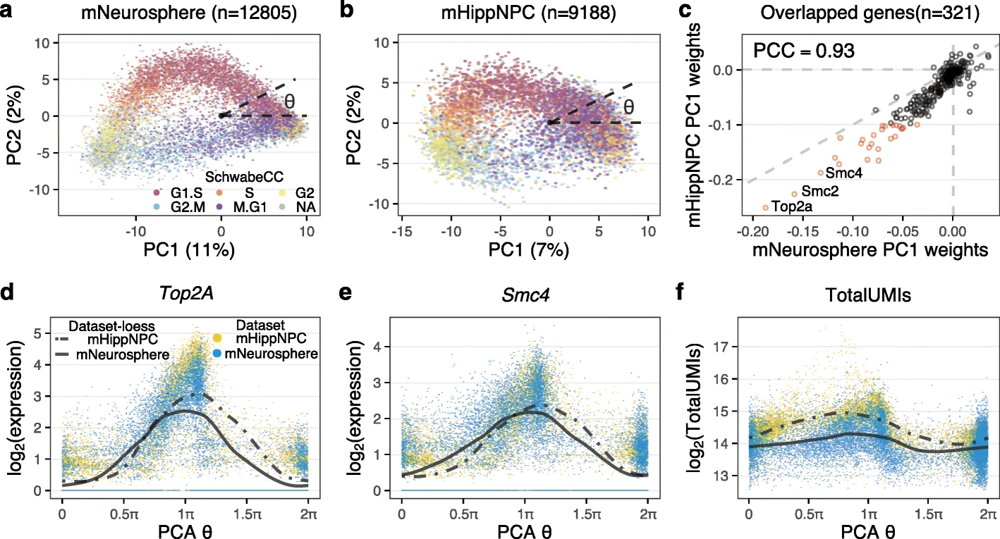

Cell cycle is known to be coupled to differentiation [@pilazProlongedMitosis2016].

We have a tool to assign continuous cell cycle state [@zhengUniversalPrediction2022].

Two main threads to go on:

### Cell cycle inhibitors
> How specifically does cancer drugs block cell division.

- Look how drugs stall the cell cycle.

### Cellular decision-making
> How does differentiation get decided.

- Model gene expression dynamics.

MERFISH

## References
